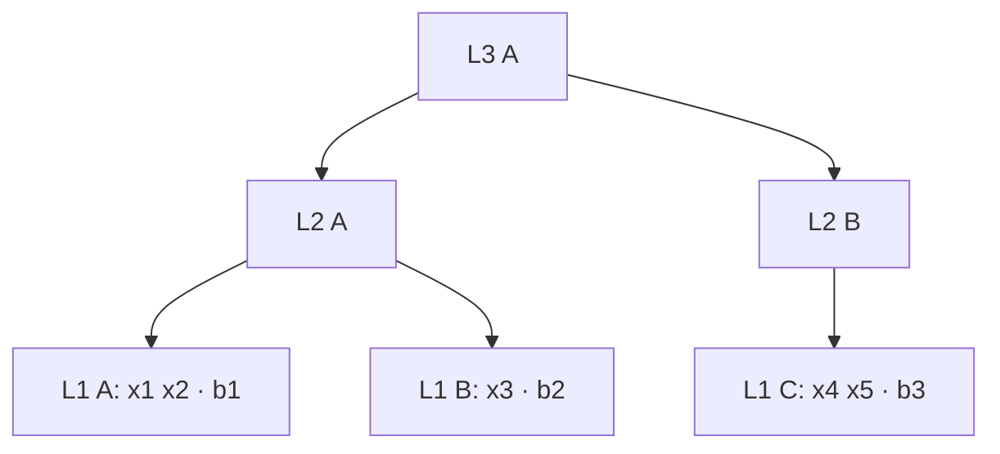
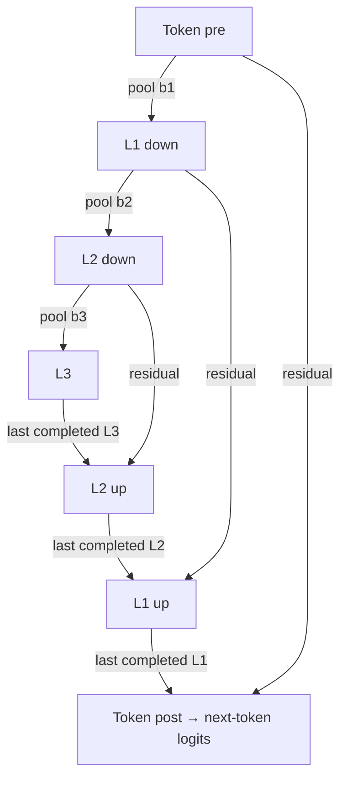

# V2: exact trees, original pooling, and the KV cache

V2 keeps the original dynamic pooling behavior. It adds a stricter tree grammar,
independent correctness tests, restart tests, and structured learning tasks.
Existing v1 checkpoints retain their original meaning.

The baseline is the **naive forward pass over the entire observed prefix**.
Caching must reproduce its next-token logits and decisions; a faster but different
model is not a successful cache implementation.

## 1. The sequence is a tree written from left to right

- `x0` through `x255` are symbols with learned embeddings, not scalar numbers.
- `b1` ends one leaf (L1).
- `b2` ends that leaf and its parent (L2).
- `b3` ends that leaf, its parent, and its top-level group (L3).
- The marker **belongs to the group it closes**. There is one marker at a leaf
  end, with the highest required level; do not emit `b1 b2 b3` for one leaf.
- Complete v2 examples have nonempty payload leaves and end with explicit
  `b3 EOS`. Prefixes can stop anywhere; stopping does not close anything.

Our running example is:

```text
SOS x1 x2 b1 x3 b2 x4 x5 b3 EOS
```

The payload tree is exactly:



This diagram shows the data tree. Actual model pooling additionally includes
SOS and the learned null contexts, as described next.

## 2. Exactly what is averaged

Each downsampling stage prepends its own learned null vector as **slot 0**.
Layer normalization and that level's transformer process every slot, including
slot 0. A parent averages the resulting child vectors with equal weight.

Let `a(t)` be the token transformer's output for token `t`, and let `H1[i]` and
`H2[i]` be the transformed L1 and L2 slot outputs. `H1[0]` and `H2[0]` are
processed null slots. These are vectors, not literal payload values.

| Slot being created | Exact inputs to its mean | Divisor |
|---|---|---:|
| L1 slot 1 | `a(SOS), a(x1), a(x2), a(b1)` | 4 |
| L1 slot 2 | `a(x3), a(b2)` | 2 |
| L1 slot 3 | `a(x4), a(x5), a(b3)` | 3 |
| L2 slot 1 | `H1[0], H1[1], H1[2]` | 3 |
| L2 slot 2 | `H1[3]` | 1 |
| L3 slot 1 | `H2[0], H2[1], H2[2]` | 3 |

Each mean then passes through that stage's layer normalization and transformer.
The stage's own null is prepended separately; it is not inserted into every mean.
For example, L2's first mean includes **L1's processed null**, not L2's raw null.
After the first L2 group closes, its accumulator resets to zero: the next parent
does not receive another copy of the lower-level null.

`EOS` has no close event. If we feed the entire example, its token representation
sits in a new, unfinished L1 group. It does not create any L1/L2/L3 slot. Normal
generation can stop as soon as EOS is predicted, before feeding EOS back in.

A scalar illustration, separate from the learned model: if three included child
vectors were `10` (null), `2`, and `6`, the parent mean would be `(10+2+6)/3 = 6`.
Removing null would give `4`, which is a different model. If those last two children
summarized one and three tokens, the equal-child mean would still be `4` without
the null; a raw-token-weighted mean would be `5`. We retain equal-child pooling.

This matches the original `shortening.py` membership operation: cumulative
boundaries **minus the current boundary** assign a token to its closing group.
There is no sentinel filter. See the original code at commit `1e6f360` and the
explicit membership tests in `tests/test_v2_semantics.py`.

## 3. When each level becomes available

The model has seven transformer stacks:



A new pooled vector is visible **at its closing token**. That token's logits
predict the following token, so this does not reveal a future target.

| Token just consumed | New completed slots | Pooled slots visible on the return path | Next token in the example |
|---|---|---|---|
| SOS | None | Initial null context | x1 |
| x1 | None | Initial null context | x2 |
| x2 | None | Initial null context | b1 |
| b1 | L1 #1 | New L1 #1; L2/L3 still null | x3 |
| x3 | None | Hold L1 #1 | b2 |
| b2 | L1 #2, L2 #1 | New L2 #1 flows into new L1 #2 | x4 |
| x4 | None | Hold L1 #2 | x5 |
| x5 | None | Hold L1 #2 | b3 |
| b3 | L1 #3, L2 #2, L3 #1 | New L3 → new L2 #2 → new L1 #3 | EOS |
| EOS, if fed | None | Hold L1 #3 | Normally no further decoding |

The incomplete group still affects predictions through finer-resolution residual
paths. Pooling does not discard the token transformer's current information.
Previously completed return-path outputs are not retroactively updated when a
later parent closes; that would violate causality and invalidate earlier K/V.

## 4. What the cache stores and why it is enough

Naive inference reruns all seven stacks over each growing prefix. Cached inference
processes one new position in each stack that actually advances:

| Stack | When it advances | Real positions after the full example |
|---|---|---:|
| Token pre / token post | Every consumed token | 10 each |
| L1 down / L1 up | Initially null, then every b1/b2/b3 | 4 each |
| L2 down / L2 up | Initially null, then every b2/b3 | 3 each |
| L3 | Initially null, then every b3 | 2 |

For **every transformer layer**, the cache stores the keys and values of its past
real positions. A new query attends to those keys plus its own key. Old keys and
values remain valid because earlier hidden states depend only on earlier inputs.

K/V alone is insufficient. We also retain:

- Three running sums and counts for unfinished groups.
- The last L3 output, last L2-up output, and last L1-up output.
- Valid-slot masks, used buffer lengths, and projected relative-position tables.
- Per-sequence grouping-rule state (position, previous token, close counts).

For our example, running counts after consuming each token are:

| Moment | Pending L1 count | Pending L2 count | Pending L3 count |
|---|---:|---:|---:|
| Initialization | 0 | 1 (L1 null) | 1 (L2 null) |
| SOS | 1 | 1 | 1 |
| x1 | 2 | 1 | 1 |
| x2 | 3 | 1 | 1 |
| b1 | 0 | 2 | 1 |
| x3 | 1 | 2 | 1 |
| b2 | 0 | 0 | 2 |
| x4 | 1 | 0 | 2 |
| x5 | 2 | 0 | 2 |
| b3 | 0 | 0 | 0 |
| EOS, if fed | 1 | 0 | 0 |

At `b3`, add the current token to L1, average and reset L1, process the new L1
slot, add it to L2, average and reset L2, and similarly finish L3. Then compute
the new L2-up and L1-up outputs in that order, followed by token post.

## 5. A second tree: the null is included only once

```text
SOS x1 b3 x2 b3 EOS
```

This has two top-level groups, each containing one parent and one leaf.

| Mean | Members |
|---|---|
| L1 #1 | SOS, x1, b3 token representations |
| L1 #2 | x2, b3 token representations |
| L2 #1 | L1 null, L1 #1 |
| L2 #2 | L1 #2 |
| L3 #1 | L2 null, L2 #1 |
| L3 #2 | L2 #2 |

The two `b3` tokens close different groups. EOS is again an unfinished tail.
The asymmetry between first and later groups is intentional inherited behavior.

## 6. Batches: physical slots versus real positions

Suppose member A closes at every step while B closes only at the last step.
Their L1 cache might look like this (slot 0 is the initial null):

| Physical slot | Member A | Member B |
|---|---|---|
| 0 | Null, real ordinal 0 | Null, real ordinal 0 |
| 1 | Group 1 | Padding |
| 2 | Group 2 | Padding |
| 3 | Group 3 | Group 1, real ordinal 1 |

At B's new group, attention sees distances `1` to null and `0` to itself.
It must **not** use physical-slot distance `3` to null. Padding is masked, and
relative distances count only real slots. Every layer follows this rule.
Buffers grow when necessary, while the represented sequence remains unchanged.

## 7. Pause and continue

A pause after `x3` must preserve the open token group containing `x3`, the pending
L2 children, and the last completed outputs. It does not behave like `b1` or EOS.

`cache_session.py` provides a CPU reference snapshot format for these tests.
It saves the complete cache and grouping state atomically, and rejects restoration
with changed weights, grouping rule, semantic contract, dtype, or recorded backend
settings. It is a greedy validation utility, not a production serving or
cross-device migration format. Tests reload it in a separate Python process.

For project recovery, read `docs/WORK_STATE.md` and `TODO.md`. Learning runs record
case IDs, executable-source hashes, dataset hashes, seeds, and per-case results;
training checkpoints include optimizer and RNG state until a case completes.

## 8. Longer sequences with interspersed closes

A small version of the long stress pattern is:

```text
SOS x1 b1 x2 b2 x3 b3 x4 b1 x5 b2 x6 b3 EOS
```

Its exact model groups are:

| Level | Completed groups in order (null slot is 0) |
|---|---|
| L1 | `[SOS,x1,b1]`; `[x2,b2]`; `[x3,b3]`; `[x4,b1]`; `[x5,b2]`; `[x6,b3]` |
| L2 | child slots `[0,1,2]`; `[3]`; `[4,5]`; `[6]` |
| L3 | child slots `[0,1,2]`; `[3,4]` |

The L2/L3 entries denote transformed child vectors. Only their first groups
include a lower-level null. The second b3 creates a second top-level group;
it does not modify the first one.

The executed long tests extend this to 512, 1,024 and 2,048 tokens, with uneven
leaf sizes, many b1/b2/b3 markers and an open tail. A 2,048-token member has
411/166/63 completed L1/L2/L3 groups. Both trained checkpoints retain matching
greedy choices, but several float32 logit differences exceed the old numerical
bound. These are reported as failures, not absorbed into a wider tolerance.

## 9. What the experiments can establish


The independent oracle checks the naive model's grouping semantics first.
Cache tests then check internal state and per-layer K/V as well as predictions.
The structured tasks separately ask whether the model learns repetition or
copying across groups. Their results and remaining limitations are in
[v2_results.md](v2_results.md).

Global token attention and residuals can solve these tasks without relying on
coarse levels. A successful copy task alone does not establish that a hierarchy
level is necessary. The flat control and coarse-output ablations address that
question, within the limits of small CPU experiments.
